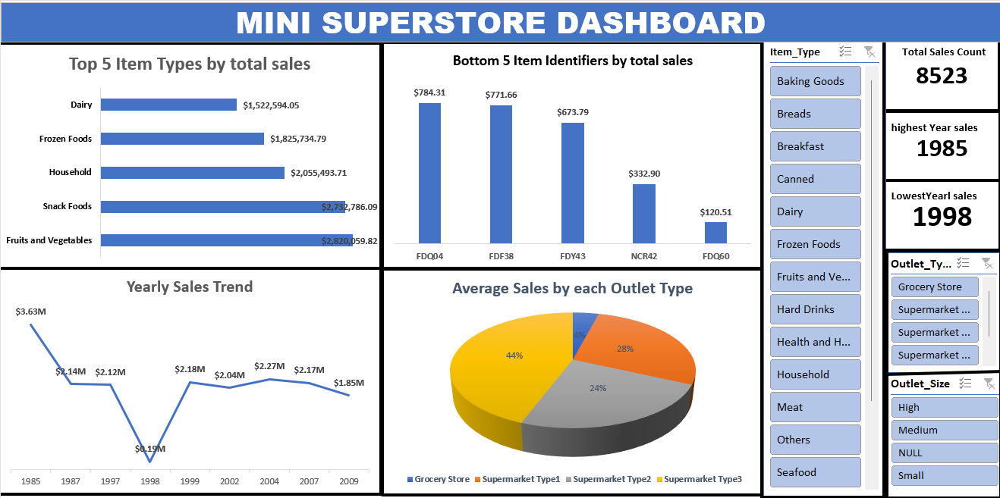

# Mini-Super-Store-Data-Analysiss

## TABLE OF CONTENT

- [INTRODUCTION](#Introduction)

- [DATA DESCRIPTION](#Data-Description)

- [Data Collection and Preparation ](#Data-Collection-and-Preparation)

- [Data Analysis](#Data-Analysis)

- [Skills demonstrated](#Skills-demonstrated)

- [Visualizations](#Visualizations)

- [Insight from analysis](#Insight-from-analysis)

- [Summary of Analysis](#Summary-of-Analysis)

- [Conclusion](#Conclusion)

## INTRODUCTION
This project analyzes a retail sales dataset using Microsoft Excel to examine how product attributes and outlet characteristics influence sales performance. Data cleaning and preparation are carried out in Excel to handle missing values, inconsistent formats, and categorical variables. Through sorting, filtering, pivot tables, and charts, the analysis provides insights that support informed decision-making in retail operations.

## Data-Description
The dataset used in this analysis contains retail sales records with information on products, outlets, and sales performance. Each row represents a single product sold in a specific outlet, while each column describes a particular attribute of the product or outlet. The dataset is analyzed using Microsoft Excel.
- Item_Identifier: A unique code assigned to each product item.
- Item_Weight: The weight of the product item measured in kilograms.
- Item_Fat_Content: Indicates the fat content of the product (e.g., Low Fat, Regular).
- Item_Visibility: The percentage visibility of the product on store shelves.
- Item_Type: The category to which the product belongs (e.g., Dairy, Snack Foods).
- Item_MRP: The maximum retail price of the product.
- Outlet_Identifier: A unique code identifying each retail outlet.
- Year: The year the outlet was established.
- Outlet_Size: The size classification of the outlet (Small, Medium, High).
- Outlet_Location_Type: The tier classification of the outlet location (Tier 1, Tier 2, Tier 3).
- Outlet_Type: The type of retail outlet (e.g., Supermarket Type1, Grocery Store).
- Sales: The total sales value generated by the product.
- Sales_categorize: A categorical variable indicating the sales level (e.g., Low).

This dataset enables the analysis of relationships between product characteristics, outlet features, and sales performance using Excel-based tools such as pivot tables and charts.

## Data Collection and Preparation 
#### Raw data:
The raw data used in this study was obtained from Mimi Super Store, a retail outlet that records daily product sales and outlet information
[Download Mini Super Store](Mini_Super_Store_Data_Analysis.xlsx)

### Tools used: Excel(Pivot table, pivot chart)

## SKILLS DEMONSTRATED:
- Converted all currency values from Pounds (£) to Dollars ($).
- Replace all blank fields with the word "Null ".
- Created a new column and name it  categorize sales: Sales above $5,000 should be labeled as "High", Sales below $5,000 should be labeled as "Low".

- Data visualization 
- Dashboard development 
- Insight Generation 

### Data Analysis:
- Top 5 Item Types by total sales
- Bottom 5 Item Identifiers by total sales
- Yearly Sales Trend
- Average Sales by each Outlet Type
- Total Sales Count
- Identify the year with the highest and lowest total sales

## Visualizations:
Visualizations were created using Microsoft Excel to summarize the data and clearly communicate key patterns and trends in sales performance. Excel tools such as charts, pivot charts, and conditional formatting were used to transform numerical data into visual insights. The following visualizations were employed in the analysis:
- Bar Charts
- Column Charts
- Pie Charts
- Line Charts
- 
